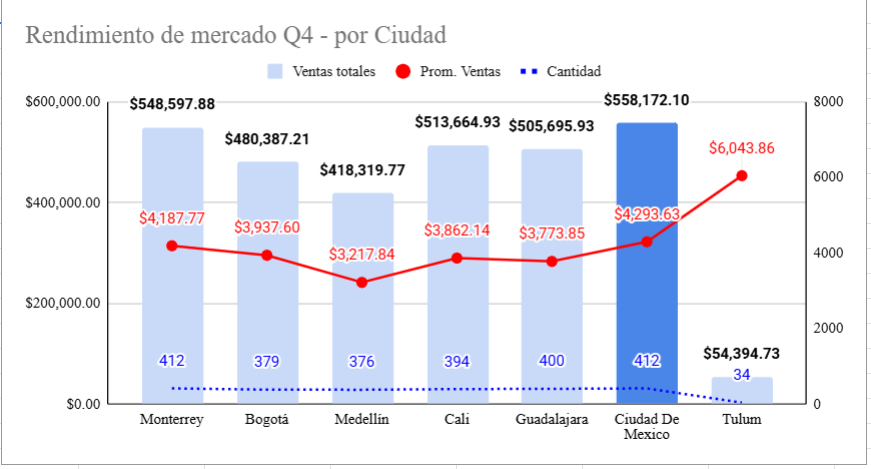

# -Venta-Express-Caso-Practico-Tripleten
Caso práctico del bootcamp "Data Analyst" Empresa: VentaExpress

Se me presentó un caso como analista de datos en "VentaExpress", una empresa de comercio electrónico en crecimiento. En el supuesto el director de operaciones me asignó analizar los datos de ventas del último trimestre para preparar un informe ejecutivo.

## 📸 Análisis

.png)
.png)

## Conclusión y Recomendación
Al analizar las ventas totales y el promedio de ventas de Monterrey, se recomiendó aumentar la venta de productos con mayor denominación para así poder captar mayor cantidad monetaria. Se dedujo que no existiría un impacto negativo en dicho mercado ya que el número de transacciones era igual a la de Ciudad de México y solo existía una diferencia de $105.86 en el promedio de ventas de ambas ciudades.
